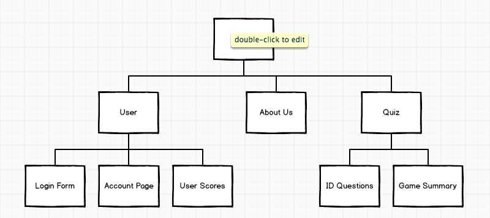

#  FlashCard Quiz Game
Group 8 JavaScript Quiz app 
//TODO 
WIREFRAMES, ERD, Project Board, StyleGuide

## Project Proposal
A FlashCard Quiz Game with various quiz types and difficulty settings. Quiz questions will be acquired through Quizlet API or other. 

## Time and Priority Matrix 

## User stories 
*  As a user I want see the login link when I visit home page.
*  When I press the login button, I want to be able to enter my username and password or create new account.
*  As a logged in user, I want my information to persist between sessions.
*  As a logged in user, I want to be able to logout.
*  As a user, I want to be able to see the type of quiz I want to take using a dropdown menu.
*  As a user, I want to be able to choose a difficulty level using a dropdown menu.
*  When i select my game options, I want to see the quiz questions one a time.
*  I want to be able to select an answer and have it stored for grading at the end of the quiz.
*  When I complete the quiz, I want to see a score output with correct and incorrect answers.
*  When the game summary is displayed, I want to be able to select a new quiz type to play again.

## Third Party Technologies
*  APIs
*  Express
*  React
*  Axios
*  body-parser

### PostMVP
Hints for questions, timer, card back and index card design, 
